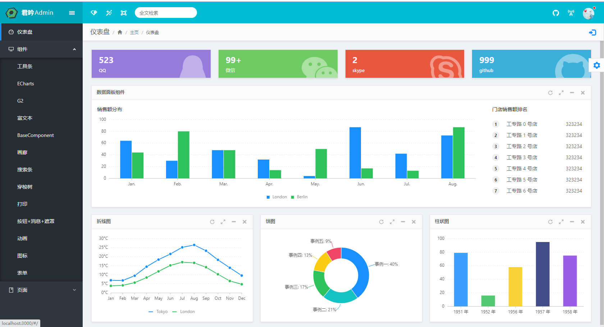

# antd-dev-admin

使用开源框架地址 https://github.com/LANIF-UI/dva-boot-admin


简单的后台接口对接crud 和登录 

后台接口地址   https://github.com/zmj0920/koaproject


## 工程结构

```
├── public                   # 不参与编译的资源文件
├── src                      # 主程序目录
│   ├── index.js             # 程序启动和渲染入口文件
│   ├── config.js            # 全局配置
│   ├── menu.js              # 左侧菜单配置
│   ├── components           # 全局公共组件
│   ├── layouts              # 页面结构组件
│   │   ├── BasicLayout      # 基本布局
│   │   └── OtherLayout      # 布局组件根据具体功能调整，在路由配置中引用
│   ├── routes               # 动态路由目录（每个功能一个文件夹的MVC结构）
│   │   ├── index.js         # 路由配置文件
│   │   ├── Home             # 功能模块
│   │   │   ├── index.js     # 路由配置文件
│   │   │   ├── assets       # 单独属于这个模块的静态资源文件
│   │   │   ├── components   # 页面组件
│   │   │   ├── model        # dva model
│   │   │   ├── service      # dva service
│   │   │   └── routes **    # 子路由(目录结构与父级相同)
│   │   └── Login            # 功能模块
│   │       ├── index.js     # 路由配置文件
│   │       ├── assets       # 单独属于这个模块的静态资源文件
│   │       ├── components   # 页面组件
│   │       ├── model        # dva model
│   │       ├── service      # dva service
│   │       └── routes **    # 子路由(目录结构与父级相同)
│   ├── utils                # 工具类
│   └── assets               # 资源文件
│           ├── fonts        # 字体 & 字体图标
│           ├── images       # 图片
│           └── styles       # 全局样式
```


# 截图




